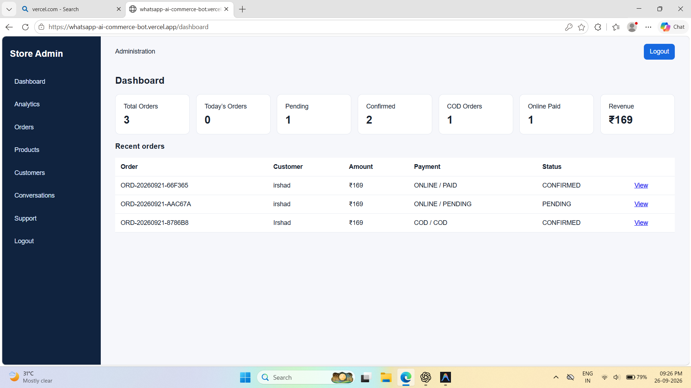
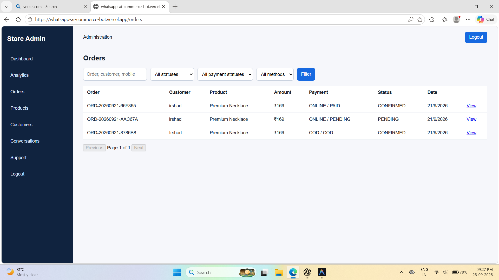
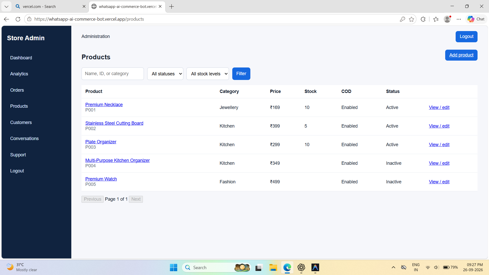
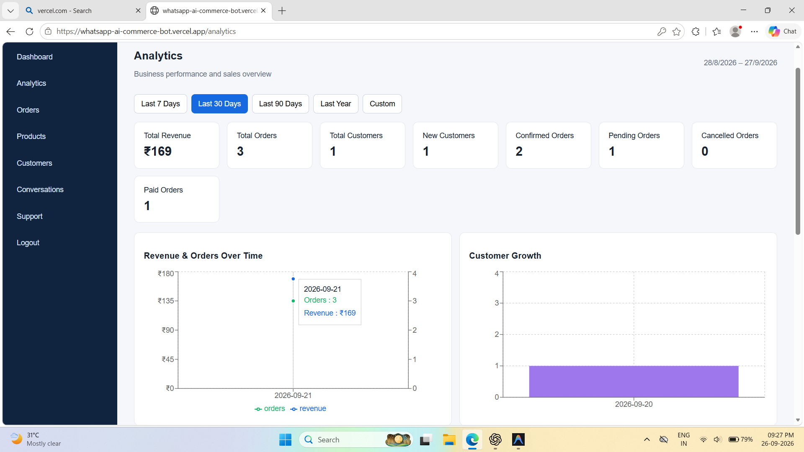
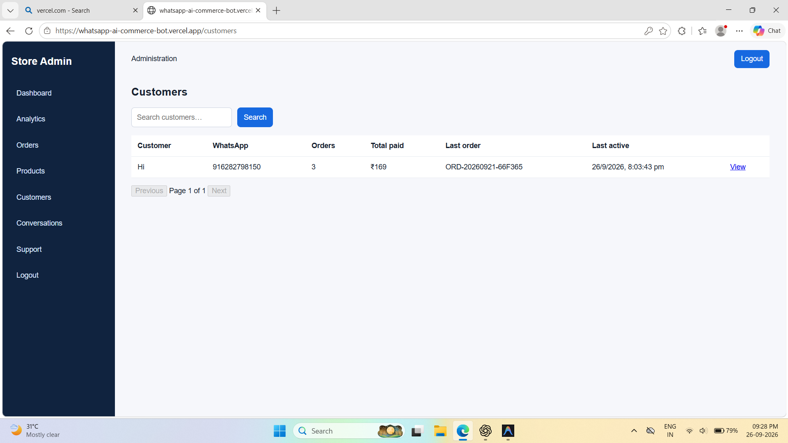
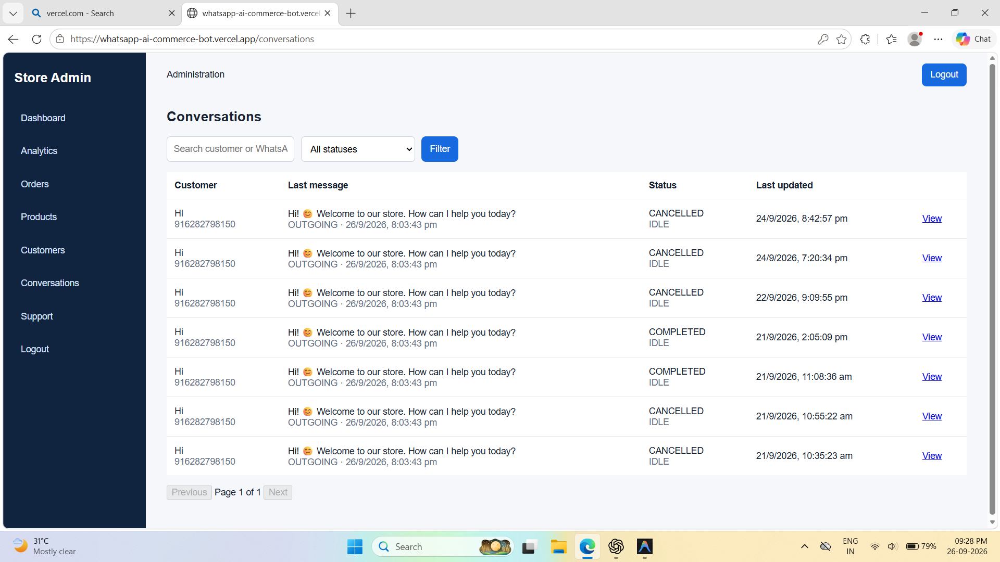
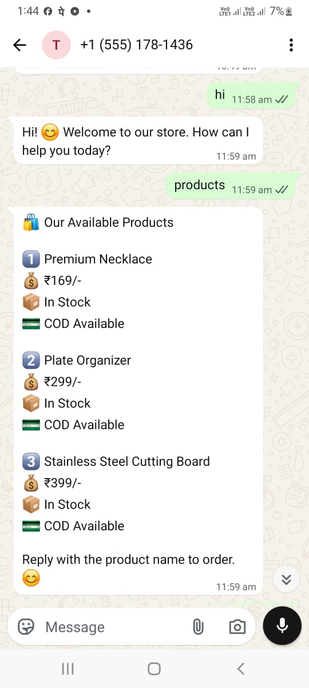
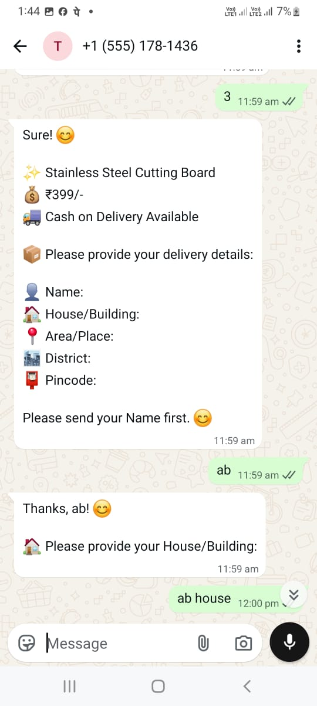
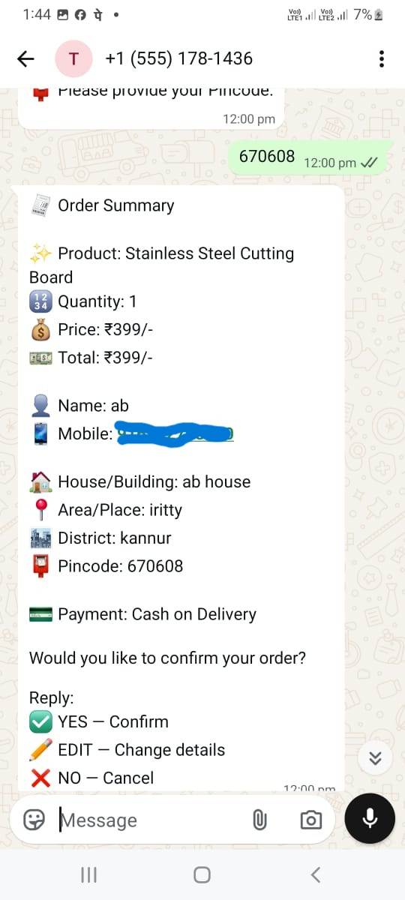
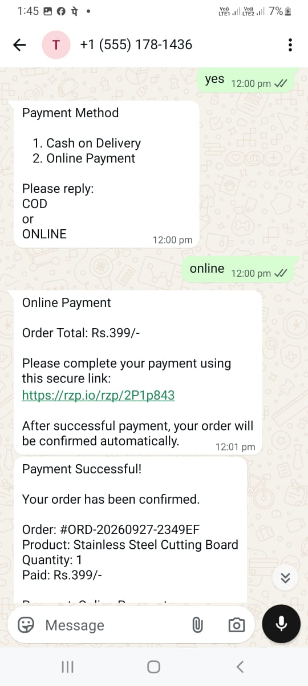

# WhatsApp AI E-commerce Automation Platform

## Overview

Production-style WhatsApp storefront automation backed by MongoDB, Gemini-assisted product responses, COD/Razorpay payment handling, and a protected Next.js administration dashboard.

## Live Demo

- **Admin Dashboard**: [https://whatsapp-ai-commerce-bot.vercel.app](https://whatsapp-ai-commerce-bot.vercel.app)
- **Backend Health**: [https://whatsapp-ai-commerce-bot.onrender.com/health](https://whatsapp-ai-commerce-bot.onrender.com/health)
- **GitHub**: [https://github.com/irshadkk-coder/whatsapp-ai-commerce-bot](https://github.com/irshadkk-coder/whatsapp-ai-commerce-bot)

## Key features

- Persistent products, customers, conversations, messages, orders, and historical product snapshots
- WhatsApp ordering, delivery collection, human handoff, and internal support notes
- COD plus Razorpay Payment Links with signed webhook verification
- Lifecycle-controlled shipping, delivery estimates, stored tracking details, and WhatsApp order tracking
- Admin management for orders, products, customers, conversations, support, and analytics

## Screenshots

### Admin Dashboard


### Orders


### Product Management


### Analytics


### Customers


### Conversations


## WhatsApp Ordering

### 1. Product Catalogue


### 2. Product Selection


### 3. Order Summary


### 4. Online Payment


## Architecture, data model, and security

Express is the business and integration boundary; MongoDB is the source of truth. Gemini is assistance only and does not control price, stock, delivery, orders, or payments. The Next.js dashboard calls JWT-protected admin APIs. See [architecture](docs/ARCHITECTURE.md), [API reference](docs/API.md), and [security guidance](docs/SECURITY.md).

The webhook keeps WhatsApp and Gemini integration, while MongoDB is the source of truth for customers, active order conversations, messages, products, and orders.

## Configure MongoDB Atlas

1. Create an Atlas cluster and database user.
2. Add your server IP address to Atlas **Network Access** (use `0.0.0.0/0` only temporarily for development).
3. Copy the Node.js connection string, replace its password, and put it in `.env`.

Copy `.env.example` to `.env` and set all values:

```env
MONGODB_URI=mongodb+srv://<user>:<password>@<cluster>/<database>?retryWrites=true&w=majority
GEMINI_API_KEY=
WHATSAPP_TOKEN=
PHONE_NUMBER_ID=
VERIFY_TOKEN=
PORT=5000
RAZORPAY_KEY_ID=your_key_id
RAZORPAY_KEY_SECRET=your_key_secret
RAZORPAY_WEBHOOK_SECRET=your_webhook_secret
```

Never commit `.env`, `.env.local`, or deployment secrets. `.env.example` lists every backend variable. The dashboard only uses `NEXT_PUBLIC_API_BASE_URL`; never place backend secrets in `NEXT_PUBLIC_*` variables.

## Install, seed, and run

```bash
npm install
npm run seed
npm start
```

`npm run seed` reads the retained `products.js` catalogue and upserts its products into MongoDB. The running server never reads `products.js`; it queries the `products` collection.

The server only begins listening after it connects to MongoDB. The Meta verification route remains `GET /webhook`, and the incoming message route remains `POST /webhook`.

## Razorpay online payments

Use Razorpay **Test Mode** credentials while developing. Set `RAZORPAY_KEY_ID`, `RAZORPAY_KEY_SECRET`, and a separate `RAZORPAY_WEBHOOK_SECRET` in `.env`; never commit those values.

After a customer confirms an order, they choose `COD` or `ONLINE`. COD creates a confirmed COD order as before. ONLINE creates a MongoDB order with `orderStatus: PENDING` and `paymentStatus: PENDING`, then sends Razorpay's secure payment-link URL through WhatsApp.

In the Razorpay dashboard, configure a webhook at:

```text
https://<your-ngrok-domain>/webhook/razorpay
```

Set its secret to `RAZORPAY_WEBHOOK_SECRET` and enable `payment.captured`, `payment_link.paid`, and `payment.failed`. The server verifies the raw-body webhook signature and checks Razorpay order ID, INR currency, and amount before atomically marking an order paid and confirmed. Replayed webhooks do not send another confirmation.

When moving to live payments, replace only the environment values with live Razorpay credentials and update the live-mode webhook configuration. Do not expose the key secret or webhook secret in WhatsApp messages, browser code, or source control.

## Order lifecycle and tracking

Orders move through `PENDING → CONFIRMED → PROCESSING → SHIPPED → DELIVERED`. They may only be cancelled while pending, confirmed, or processing. Admins provide optional carrier/tracking details when shipping; shipping and delivery changes notify the customer through WhatsApp. `DELIVERY_ESTIMATE_DAYS` configures the default business estimate for new orders (default: 5 days). Customers can ask WhatsApp to track an order or cancel an eligible order; all decisions use their own MongoDB order records.

## Admin dashboard

Set `JWT_SECRET`, `ADMIN_NAME`, `ADMIN_EMAIL`, and `ADMIN_PASSWORD` in `.env`, then create the first administrator once:

```bash
npm run seed:admin
```

Start the backend with `npm start`. The protected admin API is available under `/api/admin`. To run the separate dashboard, copy `admin-dashboard/.env.local.example` to `.env.local`, set the backend URL if needed, then run:

```bash
cd admin-dashboard
npm install
npm run dev
```

The dashboard is served by Next.js (normally at `http://localhost:3000`) and authenticates against the backend with a short-lived JWT stored in browser local storage. Do not put backend secrets in the dashboard environment file.

## Test flow

Send these WhatsApp messages in order:

1. `Hii`
2. `I need order necklace`
3. `Irshad`
4. `Kannur, Kerala`
5. `670001`
6. `YES`

The bot asks for each detail, presents a database-backed order summary, then creates one `orders` document. To prove persistence, stop the server after step 3, restart it, and continue with step 4.

Check the Atlas collections `customers`, `conversations`, `messages`, `products`, and `orders`. Incoming WhatsApp message IDs are unique, so delivery retries cannot make duplicate orders or bot replies.

## Production deployment and monitoring

Deploy the backend to a Node-compatible HTTPS host (Render, Railway, or VPS), MongoDB to Atlas, and the dashboard to Vercel or another Next.js host. Set a specific `ADMIN_DASHBOARD_ORIGIN` and configure HTTPS endpoints for WhatsApp (`/webhook`) and Razorpay (`/webhook/razorpay`). `GET /health` reports process/database readiness without secrets. The backend closes its HTTP listener and MongoDB connection cleanly on `SIGTERM` or `SIGINT`.

Before deployment, run `node --check server.js`, `node --check src/routes/adminRoutes.js`, and `npm run build` in `admin-dashboard`. Future improvements include automated integration tests, monitoring alerts, granular admin roles, and explicit support-reply controls.
