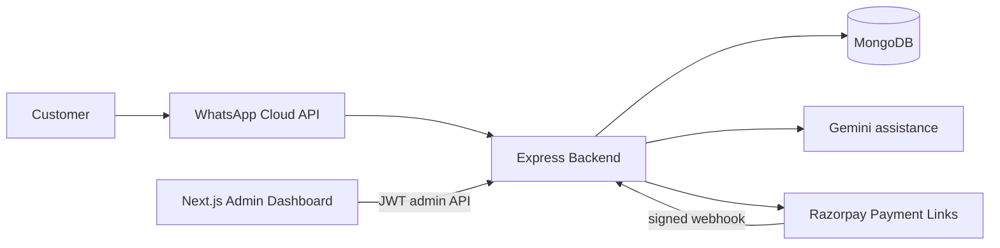

# Architecture

MongoDB is the source of truth for products, customers, conversations, messages, and order snapshots. Gemini assists replies but is never authoritative for price, stock, delivery, order, or payment state. Razorpay online payments become confirmed only after signed webhook verification. The dashboard uses protected admin APIs.

Order lifecycle and shipping data (`estimatedDeliveryDate`, carrier, tracking number, shipped/delivered timestamps) live on the existing Order document. WhatsApp tracking and cancellation resolve only orders owned by the sender's persisted customer record; shipping and delivery notifications reuse the existing WhatsApp service.
